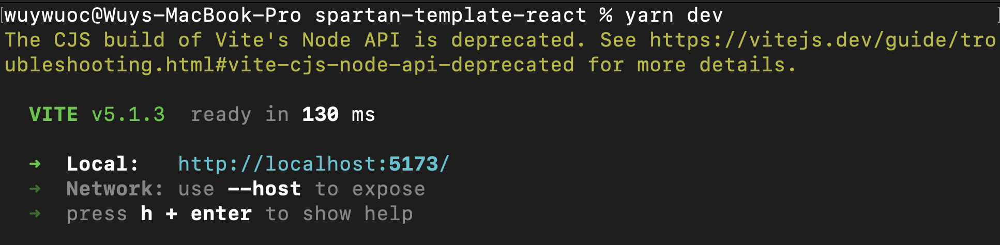
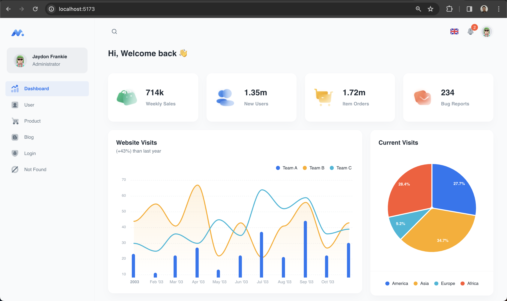
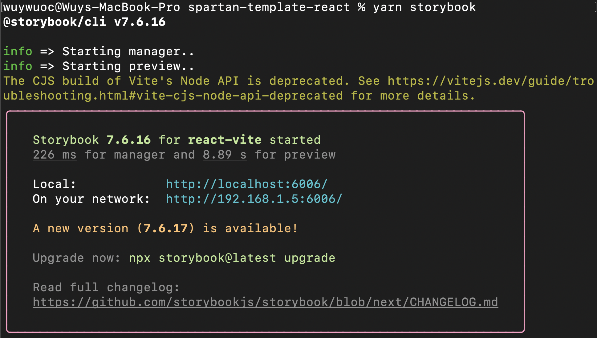
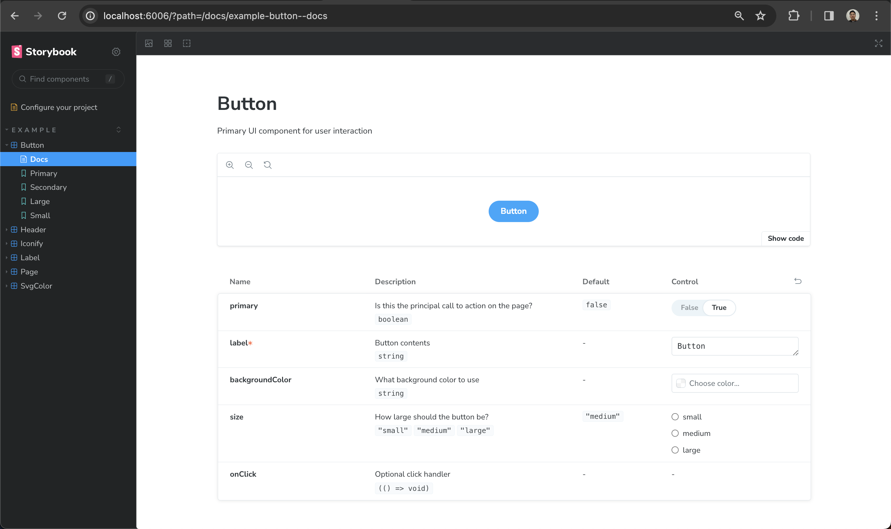

# Spartan-React

### What are people using it for

- Kickstart your React projects with **speed** and **confidence**.
- Supercharge your React development with **proven structures** and **best practices**.
- **Accelerate your React development**, build scalable, production-ready apps instantly.

### Demo

Go to the demo and see how it works

1. **Navigate to the demo folder**

  ```bash
   cd demo
  ```

2. **Follow the guidelines in README**

To implement this solution in the real world, confidently delete the demo folder and move forward.

### Table of Contents

- [Spartan-React](#spartan-react)
    - [What are people using it for](#what-are-people-using-it-for)
    - [Demo](#demo)
    - [Table of Contents](#table-of-contents)
  - [Prerequisites](#prerequisites)
  - [Key Features](#key-features)
    - [Lint Features](#lint-features)
    - [Theme Features](#theme-features)
    - [Query Features](#query-features)
    - [Chart Features](#chart-features)
    - [Page Routing Features](#page-routing-features)
    - [Form Features](#form-features)
    - [Testing Features](#testing-features)
  - [Installation](#installation)
  - [Project Structure](#project-structure)
  - [Typescript naming convention](#typescript-naming-convention)
  - [Contributing](#contributing)
  - [License](#license)


## Prerequisites

- **[Node.js](https://nodejs.org/en/)** (version 16+ or the latest LTS version) and **[yarn](https://yarnpkg.com/)** installed.
- Basic understanding of **[React.js](https://react.dev/learn/describing-the-ui)** concepts.


## Key Features

- **[React](https://react.dev/)**: A powerful JavaScript library for building dynamic and interactive user interfaces.
- **[Vite](https://vitejs.dev/)**: A lightning-fast frontend build tool that provides a streamlined development experience.
- **[TypeScript](https://www.typescriptlang.org/)**: A typed superset of JavaScript that adds optional static typing to the language.

<details>

### Lint Features

- **[Prettier](https://prettier.io/)**: An opinionated code formatter that enforces a consistent style.
- **[ESLint](https://eslint.org/)**: A static code analysis tool for identifying and reporting potential errors and code smells.

### Theme Features

- **[Material UI](https://mui.com/material-ui/)**: React component library that implements Google's Material Design. It's comprehensive and can be used in production out of the box.

### Query Features

- **[React Query](https://tanstack.com/query/v5/docs/framework/react/overview)**: A powerful library for fetching, caching, and managing server state in React applications.

### Chart Features

- **[Apexcharts](https://apexcharts.com/)**: Modern charting library that helps developers to create beautiful and interactive visualizations for web pages.

### Page Routing Features

- **[React Router DOM](https://reactrouter.com/en/6.22.2)**: A powerful routing library for React applications.

### Form Features

- **[React Hook Form](https://react-hook-form.com/)**: A performant and flexible form library for React.
- **[Yup](https://www.npmjs.com/package/yup)**: A schema builder for runtime value parsing and validation.

### Testing Features

- **[Storybook](https://storybook.js.org/)**: A frontend workshop for building UI components and pages in isolation.

</details>


## Installation

1. **Please ensure you have completed the steps outlined in the [Prerequisites](#prerequisites) section before proceeding**

2. **Clone the repository:**

   ```bash
   git clone git@github.com:c0x12c/spartan-template-react.git
   ```

3. **Navigate to the project folder:**

   ```bash
   cd spartan-template-react
   ```

4. **Install NPM packages:**

   ```bash
   yarn
   ```

5. **Start the development server:**

   ```bash
   yarn dev
   ```

   <details>
      <summary> <strong>Example screen shots</strong> </summary>

      _This will open the development server:_

   

   _Follow the link to visit admin dashboard:_

   
   </details>
   </br>

6. **Running storybook (Optional):**

   ```bash
   yarn storybook
   ```

   <details>
      <summary> <strong>Example screen shots</strong> </summary>

   _This will open the storybook development server:_

   

   _Follow the link to visit storybook ui:_

   
   </details>

## Project Structure

```
├── main.tsx --- React setup code to mount App.tsx component.
├── App.tsx --- Entry point for React application. This is where the rendering of your component tree often begins, where we define all the global providers.
├── assets --- All images, icons will be here
│   └── react.svg
├── common --- Common constants, enums etc....
│   ├── constants.ts
│   ├── enums.ts
│   └── index.ts
├── configs --- All configs will be here.
│   └── index.ts
├── modules --- This folder contains specific business domain folders and files.
│   ├── domain-a --- Specific domain A files will be here. e.g. login, overview, user.
│   │   ├── components --- React UI components if this domain will be here.
│   │   ├── hooks --- React custom hooks of this domain.
│   │   │   └── index.ts
│   │   ├── providers --- React context provider files of this domain.
│   │   │   └── index.ts
│   │   └── services --- Service files of this domain.
│   │       └── index.ts
├── routers --- All router files will be here.
│   └── router.tsx --- Define paging with lazy.
│   └── index.tsx
├── shared --- Shared common React components of this project.
│   ├── components --- Apply Atomic designs pattern to organize folders and files.
│   │   ├── atoms --- E.g. Chart, Logo, Label, Icon
│   │   ├── layouts --- E.g. DashboardLayout
│   │   ├── molecules --- E.g. dashboard/header, NotFoundView
│   │   └── index.ts
│   ├── pages
│   │   └── NotFoundPage.ts
│   │   └── index.ts
│   ├── hooks
│   │   └── index.ts
│   ├── providers
│   │   └── index.ts
│   ├── themes
│   │   └── index.ts
│   └── types
│   │   └── index.ts
│   ├── index.ts
├── utils --- Util or helper function files will be here.
│   └── formatTime.ts
│   └── index.ts
├── stories --- Visualizing and testing app component using storybook
│   ├── Button.stories.ts
│   ├── Button.tsx
│   ├── button.css
```


## Typescript naming convention

1. enum = `UserStatus` following CamelCase
2. interface = `IUserStatus` prefix with `I`
3. type = `TUserStatus` prefix With `T`
4. constant = `USER_STATUS` uppercase all character following snake_case


## Contributing

Contributions are what make the open source community such an amazing place to learn, inspire, and create. Any contributions you make are **greatly appreciated**.

If you have a suggestion that would make this better, please fork the repo and create a pull request. You can also simply open an issue with the tag "enhancement". Don't forget to give the project a star! Thanks again!

1. Fork the Project
2. Create your Feature Branch (`git checkout -b feature/AmazingFeature`)
3. Commit your Changes (`git commit -m 'Add some AmazingFeature'`)
4. Push to the Branch (`git push origin feature/AmazingFeature`)
5. Open a Pull Request


## License

[MIT](https://choosealicense.com/licenses/mit/)

<p align="right">(<a href="#spartan-react">Back to top</a>)</p>
