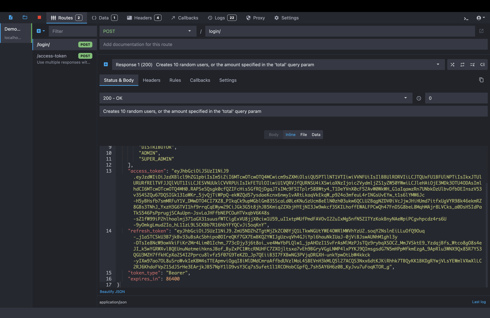

# Spartan-React demo

This demo shows the basic usage of Spartan-React

### How to use

Execute demo app with [Yarn](https://yarnpkg.com/lang/en/docs/cli/create/) to bootstrap the demo:

## Install node_modules

```bash
yarn install
```

## Run it locally

   Download https://mockoon.com

   Copy content in `demo\src\configs\mockroon.json` file an import to `mockroon`.
   <br />
   Reference link: <https://mockoon.com/docs/latest/gui-cheat-sheet/>

   <details>
      <summary> <strong>Example screen shots</strong> </summary>

   _This is GUI of Mockoon:_

   
   </details>
   <br />

   Create .env file in root `demo` folder and add:
   <br />
   ```VITE_API_ENDPOINT = 'http://localhost:5050'```
   <br />
   ```bash
   yarn dev
   ```

## License

[MIT](https://choosealicense.com/licenses/mit/)

<p align="right">(<a href="#spartan-react">Back to top</a>)</p>
